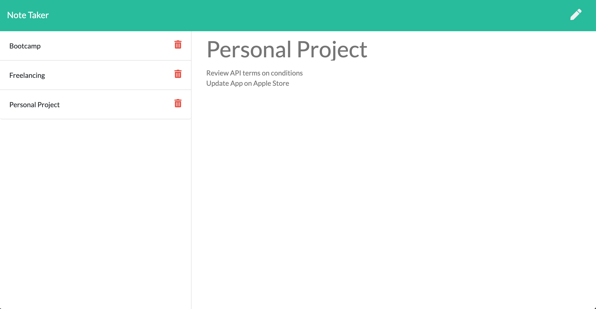

# Note Taker App

## Description

This note taker application allows users to create, display and delete notes on a web application. The notes are saved in a db.json file and returned to the webpage through an API call. 

Here is the link to the [Repository](https://github.com/PierreParienteDimitrov/note_taker)
Here is the link to the [Heroku Page](https://immense-crag-97124.herokuapp.com/)



## Table of Contents

- [Installation](#installation)
- [Usage](#usage)
- [License](#license)

## Installation

Download the zip file or clone the project to your machine. Then run npm install to download the dependencies (inquirer and jest)

```terminal
npm install
```

## Usage

To run the application, clone the repository and run this command:

```terminal
node server.js
```

## License

MIT License
